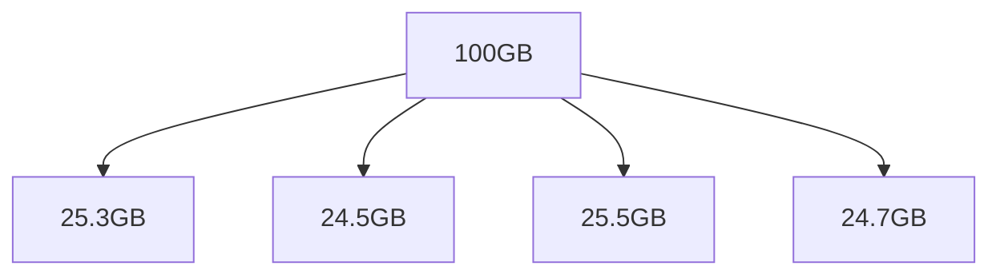

# Divide N Conquer
## No Memory,No Problem
### Introduction
#### Divide And Conquer is a simple,efficient and fail proof way to effectively manage your data while dealing with a large amount of data by using the full power of blockchain technologies Filecoin and ethereum.
#### The main idea behind this project is to divide the large sized data into smaller chunks and store them in different locations using blockchain technology with the help of filecoin API which lends it's efficiency and reliability to the project.

### Applications
#### Imagine wanting to install a game on your computer but the game is too large to fit both the installation and game files on your disk, this problem can be solved by using Divide And Conquer. The game can be divided into smaller chunks and stored in the blockchain and can be installed by installing and deleting different parts of the game
#### Consider another scenario where you are applying a Deep Learning Model on a huge image dataset and you don't have enough memory to store the entire dataset, this problem can also be solved by using Divide And Conquer. The dataset can be divided into smaller chunks and stored in the blockchain and can be used to train the model by downloading and deleting different parts of the dataset

### How it works
#### First the data is sent to the application through a python module that can be called while using any large dataset. The data is then divided into smaller chunks by the application which then can be retrieved chunk by chunk by calling the required method in our project

### Challenges Faced
#### Different problems include finding a proper classification algorithm that can perform incremental learning and also exploring Wix to create a website which proved to be pretty useful in the end

## Problem it solves
#### Often when working on machine learning or deep leaning models, you have to deal with large amounts of data. Some times the datasets might be as big as 500gb. In cases like that, the system you are currently working on might not have enough resourses to contain the whole data set pyshically at a time. If you've done some projects on deep learning you understand that we train the model with small amounts of data at a time, to improve processing speed and fine tune the parameters in between. we call it a batch. Even though we have a whole 500 gb dataset in the memory the training algorithm only uses the batch sized amount at a time. That means there is no point of storing the whole 500gb when we only need a batch sized amount at any single point of time.

#### This is the motivation of our problem statement. Why not just store only what we need i.e. one batch sized data at a time. Upload the whole dataset into the blockchain, divide the dataset into equal sized batches, Retrieve one batch at a time, pass the retreived batch into the training algorithm. Typically each batch takes some time while it's being processed. During that time we can download the subsequent batch from the blockchain and delete the previous batch from the memory and free that space.

#### Advantages of storing the dataset into a blockchain over conventional methods:
#### * Security of the data is ensured
#### * It's decentralised and no single entity can change the data
#### * A record is maintained of all changes done to the dataset

## Challenges we faced
#### * The process we are using to train the model ,using one batch one after another, is called incremental learning. This type is learning is not supported all models.Some models like KNN, SVM do not support this.
#### * 

# problem
- while dealing with real life datascience problems the Datasets can be very huge.
- In cases like that, the system you are currently working on might not have enough resourses to contain the whole data set pyshically at a time.
- If you've done some projects on deep learning you understand that we train the model with small amounts of data at a time, to improve processing speed and fine tune the parameters in between. we call it a **batch**.

# Solution
### Dividing the Dataset into batches of smaller size

# Use case
Consider another scenario where you are applying a Deep Learning Model on a huge image dataset and you don't have enough memory to store the entire dataset, this problem can also be solved by using Divide And Conquer. The dataset can be divided into smaller chunks and stored in the blockchain and can be used to train the model by downloading and deleting different parts of the dataset

# How to Use?
- Install the module 
- run `dividenconquer.upload()` to upload the dataset into web3.storage
- after uploading , click on the `dividenconquer.download_first()` to download the first batch of the dataset
- for the subsequent batches you can run `dividenconquer.download_next()`
- **NOTE** : these functions have to be called within the jupiter notebook while writing the ML model
